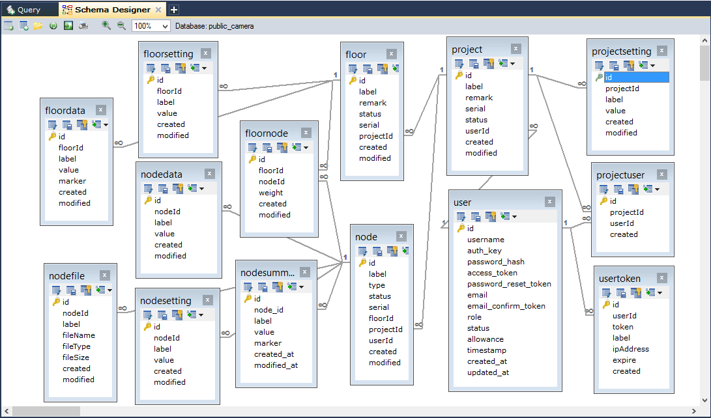

# Web Service API for Parking Lots #

* Server: http://eceiot.np.edu.sg/publiccamera/api/index.php
* IP Address: 128.199.77.122

## Database ##

__List of Key Database Objects__

Table   | Remark
---     | ---
Project    | A crowd monitoring project. Each project may have one or more Floors and Nodes.
Floor      | A logical cluster of camera nodes. Each floor may have one more more Nodes.
FloorData  | Data of each floor.
FloorSetting    | Settings for each floor.
Node | A camera node which can upload photo to server.
NodeFile    | Keep track of file list of a node, e.g. photo uploaded by each node.
NodeData    | Data value of a node, e.g. instant crowd index value for each uploaded photo.
NodeSummary | Calculated value of node data, e.g. average crowd index of a node in 15 minutes interval.
NodeSetting | Settings for each node.

---

## Crowd Index Calculation ##

1. A camera node can upload image in fixed interval. Server will trigger Python script to calculte an Instant Crowd Index for each image.  
2. An Average Crowd Index for each node is calculated in 15 minutes interval, e.g. at time 9:00am, 9:15am etc. 
3. A floor may have multiple camera nodes. Camera nodes may have different coverage area. Each node has a weight value to indicate relative size of coverage. The total weight value for a floor must be 1. 
4. The Floor Crowd Index is a weighted sum Average Crowd Index of all camera nodes on the floor.

---

## Batch Jobs ##
There are a few batch jobs running on the server in fixed interval. 

1. Calculation of current day 15-min Average Crowd Index for a node	[every 3 min]
2. Calculation of current day 15-min Floor Crowd Index				[every 5 min]
3. Calculation of weekly average of 15-min Floor Crowd Index		[daily]
4. Calculation of monthly average of 15-min Floor Crowd Index		[daily]
5. Calculation of average of 15-min Floor Crowd Index by weekdays	[daily]
6. Cleaning of NodeFile and keep only record of last 3 days			[daily]

---

## Available Web Service ##

__Common Web Service Operations__
Web services are operations for database tables. Basic operations are closely related to database operations. 

Operation   | Remark
---     | ---
List    | List all objects in the table
View    | View an object with its ID
Search  | Search for objects with some conditions
Create  | Create an new object in database
Update  | Update an object identified by ID
Delete  | Delete an object from table
Other Custom Functions  | Customized web service function

### Project ###

> A project may consist of multiple floors and each floor may has multiple camera nodes. For example, a canteen crowd monitoring project may consist of 3 canteens, and each canteen has 2 camera nodes. 

#### list ####
> List all projects. Optional to get related floors, nodes, owners and eligible users.

* URL: /v1/projects[?expand=[floors][,nodes][,owner][,users]]
* Method: GET
* Access: Anonymous

Example

* http://eceiot.np.edu.sg/publiccamera/api/index.php/v1/projects
* http://eceiot.np.edu.sg/publiccamera/api/index.php/v1/projects?expand=floors,nodes

#### view ####
> View detail info of a project. Optional to get related floors, nodes, owners and eligible users.

* URL: /v1/projects/<id\>[?expand=[floors][,nodes][,owner][,users]]
* Method: GET
* Access: Anonymous

Example

* http://eceiot.np.edu.sg/publiccamera/api/index.php/v1/project/1
* http://eceiot.np.edu.sg/publiccamera/api/index.php/v1/project/1?expand=floors,nodes,owner,users

#### search ####
> Search for projects which fulfils the query condition(s).

* URL: /v1/projects/search?<query\>
* Method: GET
* Access: Anonymous

Example: 
    
* http://eceiot.np.edu.sg/publiccamera/api/index.php/v1/projects/search?label=ECE%20Crowd%20Monitoring
    - space must be replace with %20
* http://eceiot.np.edu.sg/publiccamera/api/index.php/v1/projects/search?status=1

#### create ####
> Create a new project

* URL: /v1/projects
* Method: POST
* Access: Manager

#### update ####
> Update a existing project in database

* URL: /v1/projects/<id\>
* Method: PUT
* Access: User

#### delete ####
> Delete a project

* URL: /v1/projects/<id\>
* Method: DELETE
* Access: Manager

---

## Floor ##

> A floor is a group of camera nodes. For example, in a canteen crowd monitoring project, a canteen is a floor with multiple camera nodes. 

#### list ####
> List all floors. Optional to get related parent project, related nodes, owners and eligible users.

* URL: /v1/floors?expand=nodes,floorSettings
* Method: GET
* Access: Anonymous

Example

* http://eceiot.np.edu.sg/publiccamera/api/index.php/v1/floors
* http://eceiot.np.edu.sg/publiccamera/api/index.php/v1/floors?expand=floorSettings,nodes

#### view ####
> View detail info of a floor. Optional to get related parent project, related nodes, owners and eligible users.

* URL: /v1/floors/<id>?expand=project,nodes,floorDatas
* Method: GET
* Access: Anonymous

Example

* http://eceiot.np.edu.sg/publiccamera/api/index.php/v1/floors/1
* http://eceiot.np.edu.sg/publiccamera/api/index.php/v1/floors/1?expand=floorSettings,nodes,floorDatas

#### search ####
> Search for projects which fulfils the query condition(s).

* URL: /v1/floors/search?<query\>
* Method: GET
* Access: Anonymous

Example 

* http://eceiot.np.edu.sg/publiccamera/api/index.php/v1/floors/search?label=General%20Office

#### create ####

* URL: /v1/floors
* Method: POST
* Access: Manager

#### update ####

* URL: /v1/floors/<id\>
* Method: PUT
* Access: User

#### delete ####

* URL: /v1/floors/<id\>
* Method: DELETE
* Access: Manager

---

## FloorSetting ##

> A floor may has multiple settings. Each setting is kept as a record in FloorSetting table.  

#### list ####

* URL: /v1/floor-settings
* Method: GET
* Access: Anonymous

Example

* http://eceiot.np.edu.sg/publiccamera/api/index.php/v1/floor-settings
* http://eceiot.np.edu.sg/publiccamera/api/index.php/v1/floor-settings?expand=floor

#### view ####

* URL: /v1/floor-settings/<id>?expand=floor
* Method: GET
* Access: Anonymous

Example

* http://eceiot.np.edu.sg/publiccamera/api/index.php/v1/floor-settings/1
* http://eceiot.np.edu.sg/publiccamera/api/index.php/v1/floor-settings/1?expand=floor

#### search ####

* URL: /v1/floor-settings/search?<query\>
* Method: GET
* Access: Anonymous

Example 

* http://eceiot.np.edu.sg/publiccamera/api/index.php/v1/floor-settings/search?label=maskface

#### create ####

* URL: /v1/floor-settings
* Method: POST
* Access: Manager

Example

* Payload = {'floorId': '1', 'label': 'test', 'value': '123'}

#### update ####

* URL: /v1/floor-settings/<id\>
* Method: PUT
* Access: User

#### delete ####

* URL: /v1/floor-settings/<id\>
* Method: DELETE
* Access: Manager

---

## FloorData ##

> Crowd Index values of floors are kept in the FloorData table. Different crowd index are differentiated by labels. Currently there are these type of crowd index: CrowdMonthly, CrowdNow, CrowdWeekly, Crowd<Weekday> (CrowdMonday, CrowdTuesday etc).

#### list ####

* URL: /v1/floor-datas
* Method: GET
* Access: Anonymous

Example

* http://eceiot.np.edu.sg/publiccamera/api/index.php/v1/floor-datas

#### view ####

* URL: /v1/floor-datas/<id>?expand=floor
* Method: GET
* Access: Anonymous

Example

* http://eceiot.np.edu.sg/publiccamera/api/index.php/v1/floor-datas/186
* http://eceiot.np.edu.sg/publiccamera/api/index.php/v1/floor-datas/186?expand=floor

#### search ####

* URL: /v1/floor-datas/search?<query\>
* Method: GET
* Access: Anonymous

Example 

* http://eceiot.np.edu.sg/publiccamera/api/index.php/v1/floor-datas/search?label=CrowdMonthly

#### Latest by Project and Label ####

* URL: /v1/floor-datas/latest-by-project-and-label/<projectId\>/<label\>
* Method: GET
* Access: Anonymous

Example 

* http://localhost/publiccamera/api/index.php/v1/floor-datas/latest-by-project-and-label/1/CrowdNow

#### List by Project and Label ####

* URL: /v1/floor-datas/list-by-project-and-label/<projectId\>/<label\>
* Method: GET
* Access: Anonymous

Example 

* http://localhost/publiccamera/api/index.php/v1/floor-datas/list-by-project-and-label/1/CrowdWeekly

#### create ####

* URL: /v1/floor-datas
* Method: POST
* Access: Manager

Example

* Payload = {'floorId': '1', 'label': 'CrowdIndex', 'value': '60'}

#### update ####

* URL: /v1/floor-datas/<id\>
* Method: PUT
* Access: User

#### delete ####

* URL: /v1/floor-datas/<id\>
* Method: DELETE
* Access: Manager

---

## Node ##
> A node is a camera node which takes photo periodically and uploads them to server. 

#### list ####

* URL: /v1/nodes
* Method: GET
* Access: Anonymous

Example

* http://eceiot.np.edu.sg/publiccamera/api/index.php/v1/nodes

#### view ####

* URL: /v1/nodes/<id>?expand=project,floors,nodeDatas,nodeFiles,nodeSettings
* Method: GET
* Access: Anonymous

Example

* http://eceiot.np.edu.sg/publiccamera/api/index.php/v1/nodes/1?expand=project,floors,nodeDatas,nodeFiles,nodeSettings

#### search ####

* URL: /v1/nodes/search?<query\>
* Method: GET
* Access: Anonymous

Example: 
    
* http://eceiot.np.edu.sg/publiccamera/api/index.php/v1/nodes/search?label=abc

#### create ####

* URL: /v1/nodes
* Method: POST
* Access: Manager

#### update ####

* URL: /v1/nodes/<id\>
* Method: PUT
* Access: User

#### delete ####

* URL: /v1/nodes/<id\>
* Method: DELETE
* Access: Manager

---

## NodeData ##
> When a photo is uploaded to server, script on server will calculate the crowd index of the photo. The calculated value is saved in NodeData table.  

#### list ####

* URL: /v1/node-datas
* Method: GET
* Access: Anonymous

Example

* http://eceiot.np.edu.sg/publiccamera/api/index.php/v1/node-datas

#### view ####

* URL: /v1/node-datas/<id>?expand=node
* Method: GET
* Access: Anonymous

Example

* http://eceiot.np.edu.sg/publiccamera/api/index.php/v1/node-datas/10000?expand=node

#### search ####

* URL: /v1/node-datas/search?<query\>
* Method: GET
* Access: Anonymous

Example: 
    
* http://eceiot.np.edu.sg/publiccamera/api/index.php/v1/node-datas/search?label=CrowdNow

#### Latest by Project ####
> Get the latest NodeData of all nodes of a project.

* URL: /v1/node-datas/latest-by-project/<projectId\>
* Method: GET
* Access: Anonymous

Example: 
    
* http://eceiot.np.edu.sg/publiccamera/api/index.php/v1/node-datas/latest-by-project/1

#### Latest by Project ####
> Get the latest NodeData of all nodes of a project.

* URL: /v1/node-datas/latest-by-project-and-label/<projectId\>/<label\>
* Method: GET
* Access: Anonymous

Example: 
    
* http://eceiot.np.edu.sg/publiccamera/api/index.php/v1/node-datas/latest-by-project/1/CrowdNow

#### create ####

* URL: /v1/node-datas
* Method: POST
* Access: Manager

#### update ####

* URL: /v1/node-datas/<id\>
* Method: PUT
* Access: User

#### delete ####

* URL: /v1/node-datas/<id\>
* Method: DELETE
* Access: Manager

---

## NodeSetting ##
> A node may have multiple settings. Each setting and corresponding value is kept in the NodeSetting table.  

#### list ####

* URL: /v1/node-settings
* Method: GET
* Access: Anonymous

Example

* http://eceiot.np.edu.sg/publiccamera/api/index.php/v1/node-settings

#### view ####

* URL: /v1/node-settings/<id>?expand=node
* Method: GET
* Access: Anonymous

Example

* http://eceiot.np.edu.sg/publiccamera/api/index.php/v1/node-settings/1?expand=node

#### search ####

* URL: /v1/node-settings/search?<query\>
* Method: GET
* Access: Anonymous

Example: 
    
* http://eceiot.np.edu.sg/publiccamera/api/index.php/v1/node-settings/search?label=sleep

#### create ####

* URL: /v1/node-settings
* Method: POST
* Access: Manager

#### update ####

* URL: /v1/node-settings/<id\>
* Method: PUT
* Access: User

#### delete ####

* URL: /v1/node-settings/<id\>
* Method: DELETE
* Access: Manager

---

## NodeSummary ##
> Average crowd index of a node is calcuated by backend batch job. The result is saved in NodeSummary table.

#### list ####

* URL: /v1/node-summaries
* Method: GET
* Access: Anonymous

Example

* http://eceiot.np.edu.sg/publiccamera/api/index.php/v1/node-summaries

#### view ####

* URL: /v1/node-summaries/<id>?expand=node
* Method: GET
* Access: Anonymous

Example

* http://eceiot.np.edu.sg/publiccamera/api/index.php/v1/node-summaries/1?expand=node

#### search ####

* URL: /v1/node-summaries/search?<query\>
* Method: GET
* Access: Anonymous

Example: 
    
* http://eceiot.np.edu.sg/publiccamera/api/index.php/v1/node-summaries/search?label=crowd_15min

#### create ####

* URL: /v1/node-summaries
* Method: POST
* Access: Manager

#### update ####

* URL: /v1/node-summaries/<id\>
* Method: PUT
* Access: User

#### delete ####

* URL: /v1/node-summaries/<id\>
* Method: DELETE
* Access: Manager

#### Latest by Project ####
> Find the latest NodeSummary value of each node in the project

* URL: /v1/node-summaries/latest-by-project/<projectId\>
* Method: GET
* Access: Anonymous

Example

* http://eceiot.np.edu.sg/publiccamera/api/index.php/v1/node-summaries/latest-by-project/1

---

## NodeFile ##

>  Node file table keep track of all files uploaded by camera nodes. The physical files are saved in server in the file format of "[node]_[yyyymmdd]_[hhmmss]_[random__number]".

#### list ####
> List all NodeFiles. Optional to get related node.

* URL: /v1/node-files?expand=node
* Method: GET
* Access: Anonymous

Example

* http://eceiot.np.edu.sg/publiccamera/api/index.php/v1/node-files
* http://eceiot.np.edu.sg/publiccamera/api/index.php/v1/node-files?expand=node

#### view ####
> View detail info of a NodeFile.

* URL: /v1/node-files/<id>?expand=node
* Method: GET
* Access: Anonymous

Example

* http://eceiot.np.edu.sg/publiccamera/api/index.php/v1/node-files/51358?expand=node

#### search ####
> Search for NodeFile which fulfils the query condition(s).

* URL: /v1/node-files/search?<query\>
* Method: GET
* Access: Anonymous

Example 

* http://eceiot.np.edu.sg/publiccamera/api/index.php/v1/node-files/search?label=PortableCam

#### Latest By Project ####
> Get the latest images (NodeFile) of all camera nodes on the floor.

* URL: /v1/node-files/latest-by-project/<projectId\>
* Method: GET
* Access: Anonymous

Example

* http://eceiot.np.edu.sg/publiccamera/api/index.php/v1/node-files/latest-by-project/1

#### Latest By Project and Label ####
> Get the latest images (NodeFile), which has match a label value, of all camera nodes on the floor.

* URL: /v1/node-files/latest-by-project-and-label/<projectId\>/<label\>
* Method: GET
* Access: Anonymous

Example 

* http://eceiot.np.edu.sg/publiccamera/api/index.php/v1/node-files/latest-by-project-and-label/1/Office

#### upload ####

* URL: /v1/node-files/upload
* Method: POST
* Access: User

Example: 

* http://eceiot.np.edu.sg/publiccamera/api/index.php/v1/node-files/upload

    * Payload: `{'nodeId': 2, 'fileName': 'testfiles/0002_20160119_000911_81238700.jpg', 'label': 'This is Test 4'}`
    * Auth: user1:

#### create ####

* URL: /v1/node-files/upload
* Method: POST
* Access: Manager

#### update ####

* URL: /v1/node-files/<id\>
* Method: PUT
* Access: User

#### delete ####

* URL: /v1/node-files/<id\>
* Method: DELETE
* Access: Manager

